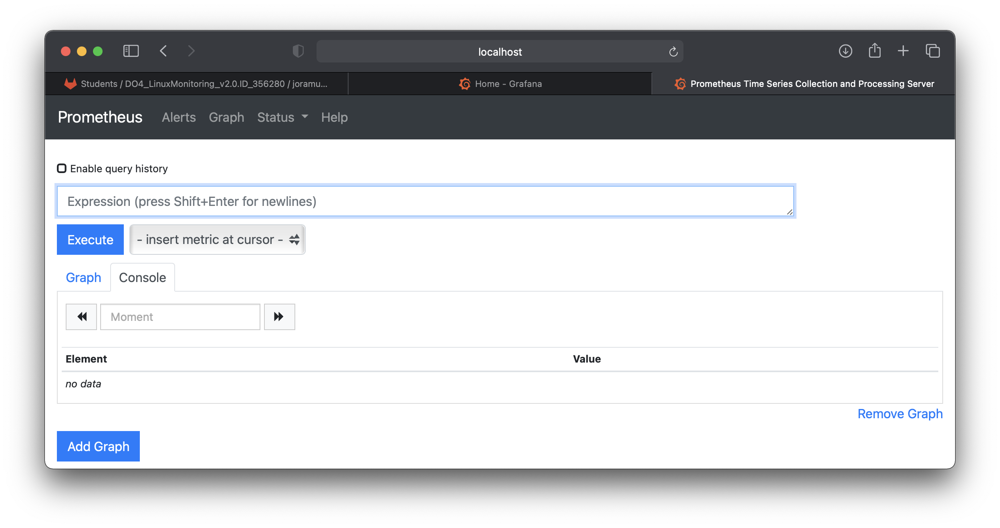
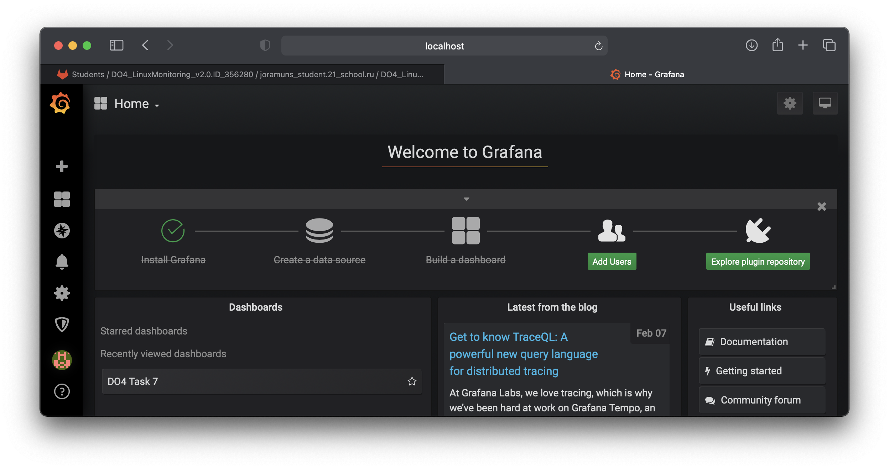
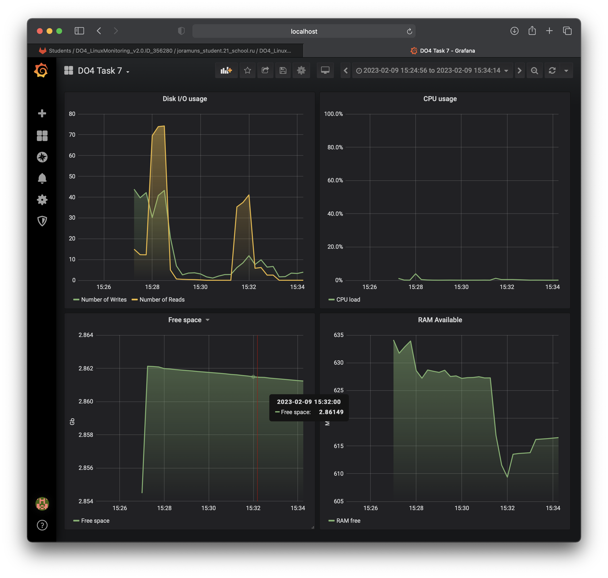
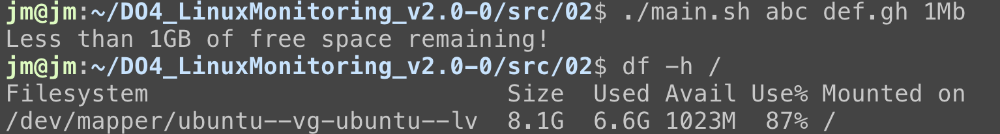
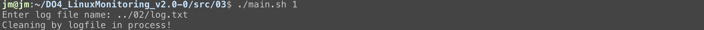
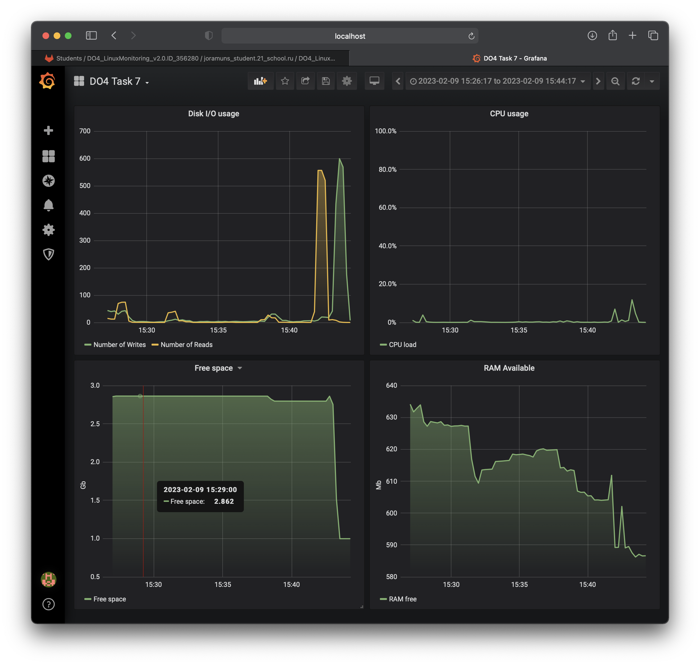
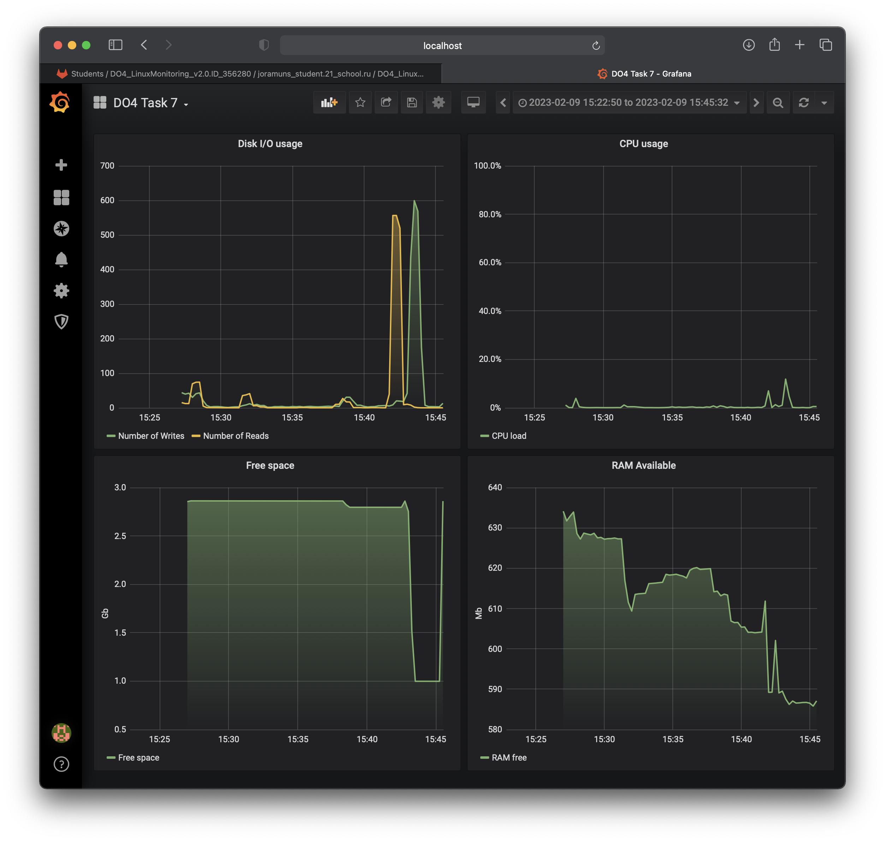
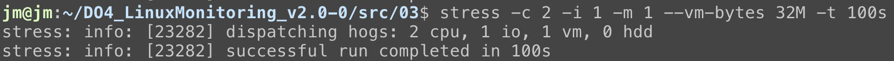
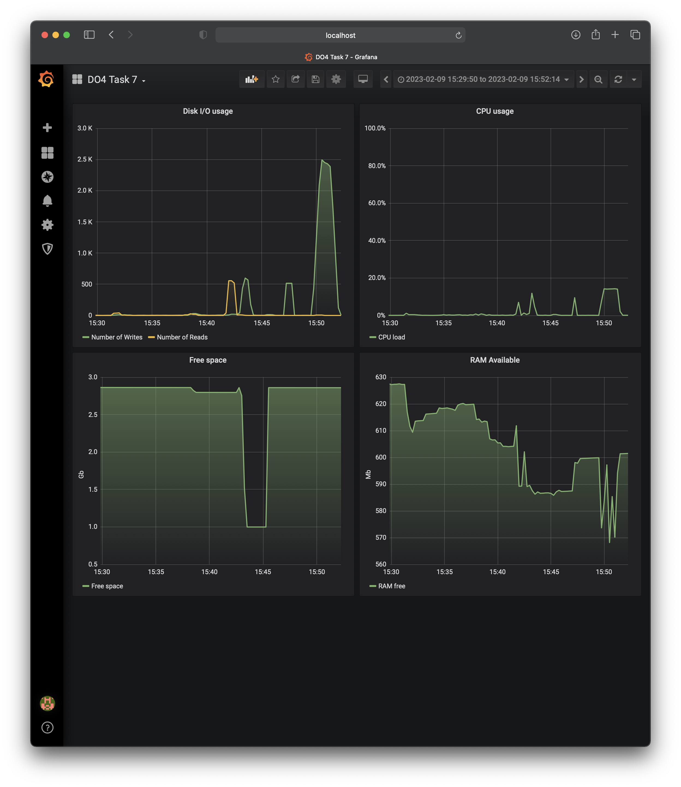

# LinuxMonitoring v2.0

## Contents

1. [Chapter I](#chapter-i) 
2. [Chapter II](#chapter-ii) \
    2.1. [GoAccess](#goaccess) \
    2.2. [Prometheus](#prometheus) \
    2.3. [Grafana](#grafana)
3. [Chapter III](#chapter-iii) \
    3.1. [File generator](#part-1-file-generator)  
    3.2. [File system clogging](#part-2-file-system-clogging)  
    3.3. [Cleaning the file system](#part-3-cleaning-the-file-system)  
    3.4. [Log generator](#part-4-log-generator)  
    3.5. [Monitoring](#part-5-monitoring)  
    3.6. [GoAccess](#part-6-goaccess)  
    3.7. [Prometheus and Grafana](#part-7-prometheus-and-grafana)  
    3.8. [A ready-made dashboard](#part-8-a-ready-made-dashboard)  
    3.9. [Bonus. Your own node_exporter](#part-9-bonus-your-own-node_exporter)  

## Part 7. **Prometheus** and **Grafana**

Practice with the logs is over for now. It's time to monitor the state of the system in general.

**== Task ==**

##### Install and configure **Prometheus** and **Grafana** in virtual machine
- sudo apt install prometheus
- sudo snap install grafana
##### Access the **Prometheus** and **Grafana** web interfaces from a local machine

`Prometheus web interface on localhost:3044 forwarded from 9090 port`

`Grafana web interface on localhost:3055 forwarded from 3000 port`

##### Add to the **Grafana** dashboard a display of CPU, available RAM, free space and the number of I/O operations on the hard disk.

- CPU usage:
    - avg(irate(node_cpu_seconds_total{mode!='idle'}[1m]))

- RAM available:
    - node_memory_MemAvailable_bytes/(1024^2)

- Free space:
    - node_filesystem_avail_bytes{device="/dev/mapper/ubuntu--vg-ubuntu--lv"}/(1024^3)

- Disk I/O usage:
    - sum(rate(node_disk_writes_completed_total[1m]))
    - sum(rate(node_disk_reads_completed_total[1m]))

`All required panels on dashboard`

##### Run your bash script from Part 2

`Make some junk on filesystem`

`Run cleaning script from part 3`

##### Check the hard disk load (disk space and read/write operations)

`System load after running script from part 2`

`System load after cleaning by script from part 3`

##### Install the **stress** utility and run the following command `stress -c 2 -i 1 -m 1 --vm-bytes 32M -t 10s`
- sudo apt install stress
- stress -c 2 -i 1 -m 1 --vm-bytes 32M -t 10s

`Executing the given example with longer time in order to see the result on dashboard better`

##### Check the hard disk, RAM and CPU load

`System load after running stress utility`
