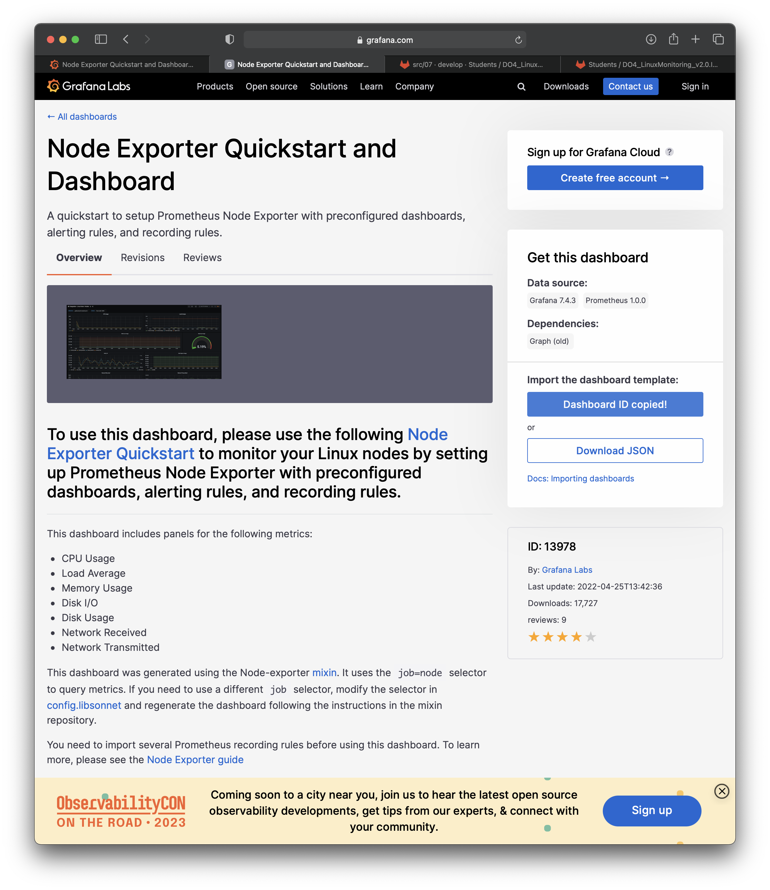
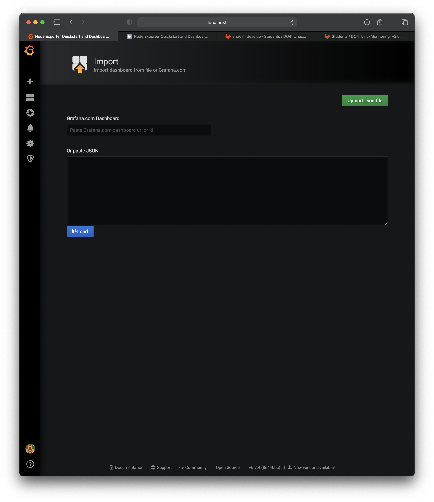

# LinuxMonitoring v2.0

## Part 8. A ready-made dashboard

##### Download the ready-made dashboard *Node Exporter Quickstart and Dashboard* from **Grafana Labs** official website.

`Just click copy Dashboard ID`

`Import menu in grafana and paste Dashboard ID`

##### Run the same tests as in [Part 7](#part-7-prometheus-and-grafana)

##### Start another virtual machine within the same network as the current one
##### Run a network load test using **iperf3**

##### Check the network interface load

## Part 9. Bonus. Your own *node_exporter*

It is always useful and convenient to analyse the system with special utilities, but you have always wanted to understand how they work.

**== Task ==**

Write a bash script or a C program that collects information on basic system metrics (CPU, RAM, hard disk (capacity)). The script or a program should make a html page in **Prometheus** format, which will be served by **nginx**. \
The page itself can be refreshed within a bash script or a program (in a loop), or using the cron utility, but not more often than every 3 seconds.

##### Change the **Prometheus** configuration file so it collects information from the page you created.

##### Run the same tests as in [Part 7](#part-7-prometheus-and-grafana)

💡 [Tap here](https://forms.yandex.ru/u/6357f4efd0468834861f10cd/) **to leave your feedback on the project**. Pedago Team really tries to make your educational experience better.
