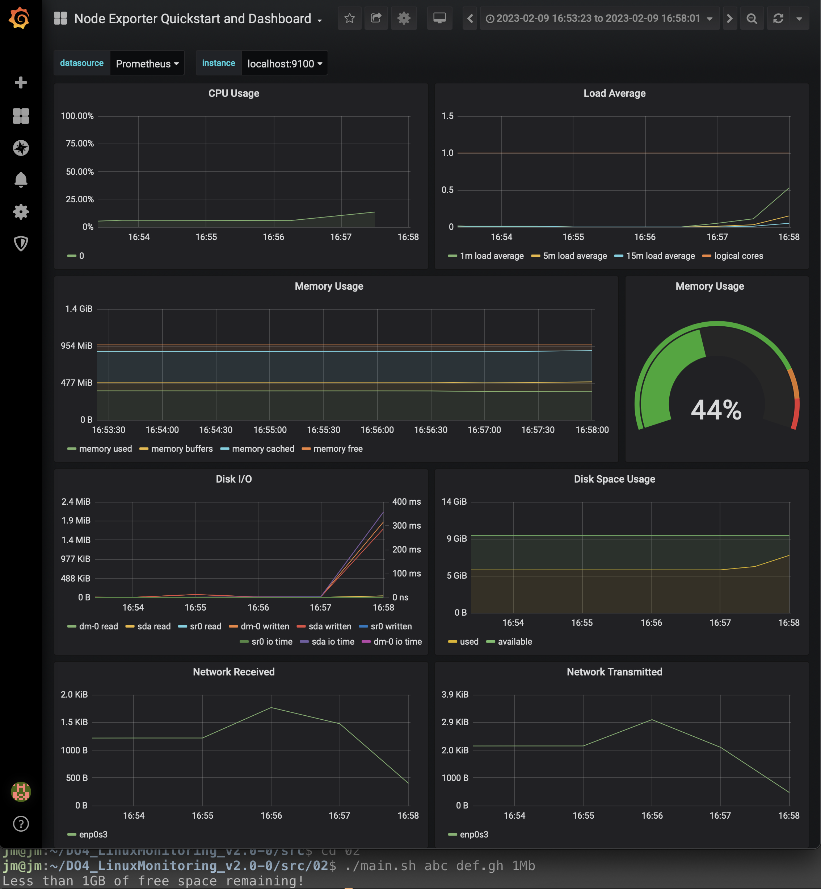
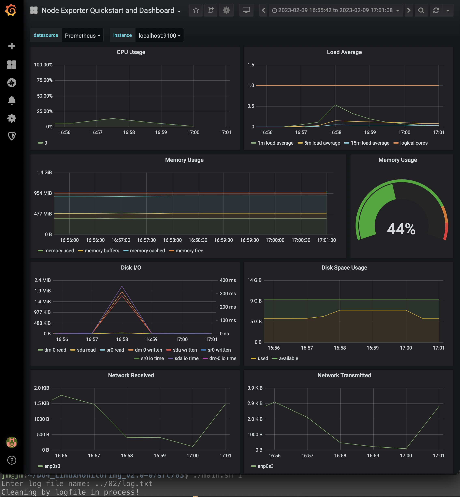
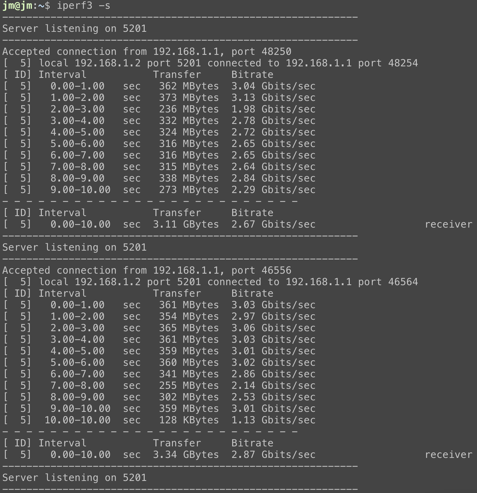
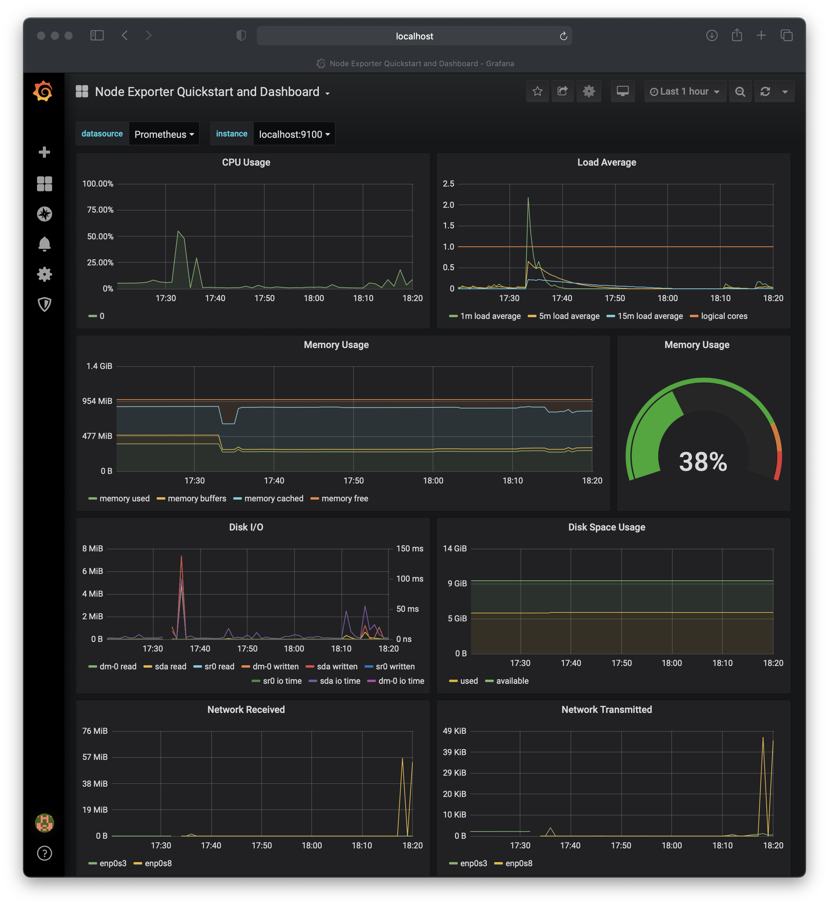

# LinuxMonitoring v2.0

## Part 8. A ready-made dashboard

##### Download the ready-made dashboard *Node Exporter Quickstart and Dashboard* from **Grafana Labs** official website.

`Just click copy Dashboard ID`

`Import menu in grafana and paste Dashboard ID`

##### Run the same tests as in [Part 7](#part-7-prometheus-and-grafana)

`Run script from Part 2 and look at dashboard`

`Run script from Part 3 to clean filesystem and check the dashboard`

##### Start another virtual machine within the same network as the current one
##### Run a network load test using **iperf3**

`Output of iperf3 server side while measuring speed`

##### Check the network interface load

`Grafana output of network usage`
