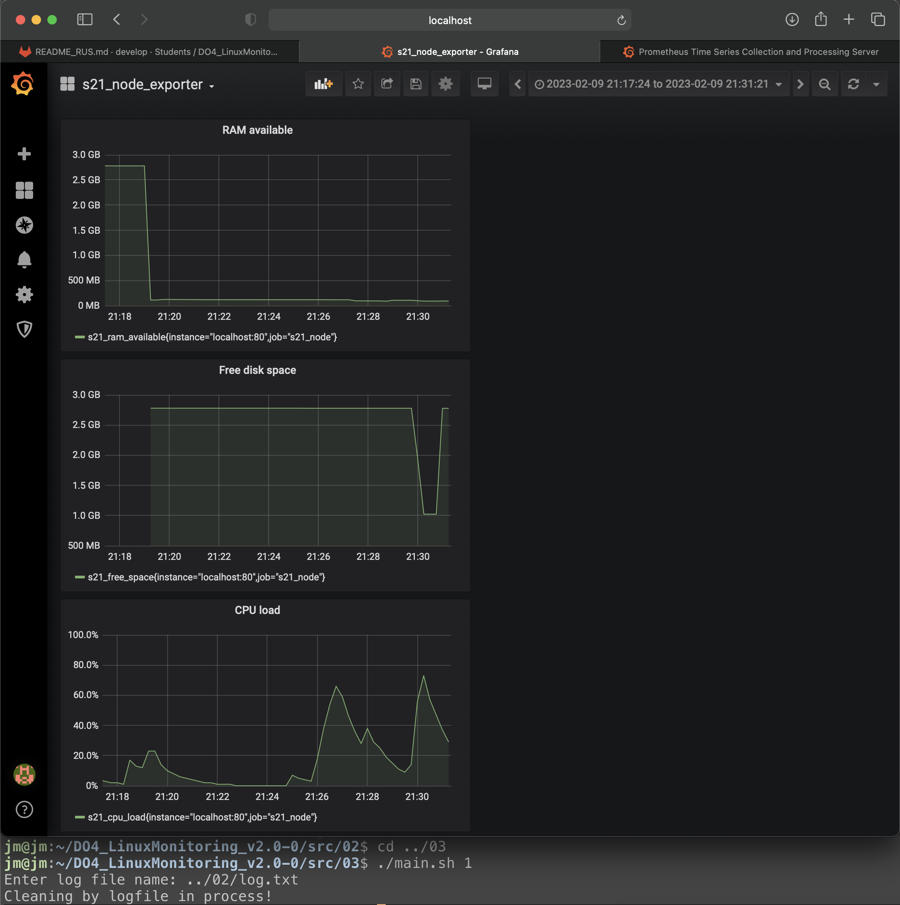
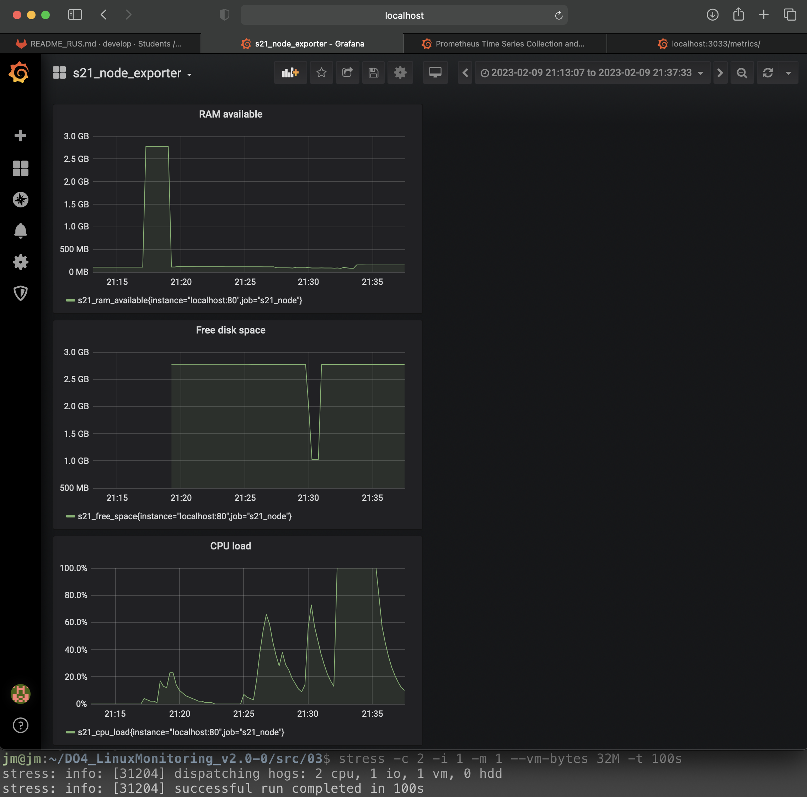

# LinuxMonitoring v2.0

## Part 9. Bonus. Your own node_exporter

##### Change the **Prometheus** configuration file so it collects information from the page you created.

- Add folder ```/metrics``` to nginx configuration file;
- Add new job to prometheus linked to nginx web server.

##### Run the same tests as in Part 7


`Test metrics with script from part 2`


`Test metrics with script from part 3`



`System load after running stress utility`
